import useBaseUrl from '@docusaurus/useBaseUrl';

# Introducere

## Noua platformă de publicare a datelor geo-spatial.org

O dată cu noua versiune a sitului geo-spatial.org au apărut o serie de schimbări în modul în care datele pot fi accesate. Digrama de mai jos ilustrează întregul proces de creare, documentare, publicare și accesare a datelor geo-spatial.org..

```mermaid
graph TD
    %% Faza 1: Preluarea și pregătire date
    subgraph " "
        Phase1_Title["Faza 1: Preluarea și pregătire date"]
        Phase1_Title --> A[Identificare / Creare set de date]
        A --> B{Date existente de la altă instituție?};
        B -- Da --> C[Corectare, optimizare, îmbogățire];
        B -- Nu --> D[Creare de la zero];
    end

    %% Conectare spre Faza 2
    C --> E((Start procesare ETL));
    D --> E;

    %% Faza 2: Procesare ETL și documentare
    E --> F["Faza 2: Procesare ETL și documentare"];
    subgraph " "
        F --> G["Alocare nume codificat și titlu"];
        G --> H["Generare thumbnail"];
        H --> I["Creare reguli de simbolizare"];
        I --> K["Crearea procedurii ETL (Bash/Python, GDAL, QGIS, etc.) și procesarea datelor"];
        K --> L["Documentarea pașilor ETL, inclusiv crearea unei diagrame explicative"];
    end

    %% Conectare spre Faza 3
    L --> N((Date procesate și documentate));

    %% Faza 3: Stocare, publicare și catalogare
    N --> O["Faza 3: Stocare, publicare și catalogare"];
    subgraph " "
        O --> P{Tip date?};

        P --> FormateVectoriale["<b>Generează formate vector</b><br><i>PostGIS, <a href='#'>GeoPackage</a>, Shapefile, GeoParquet, FlatGeobuf, KML, GeoJSON, TopoJSON</i>"];

        P --> FormateRaster["<b>Generează formate raster</b><br><i>COG, Zarr, NetCDF</i>"];

        %% Cale Publicare Servicii
        FormateVectoriale --> Q["Publicare via GeoServer"];
        FormateRaster --> Q;
        Q --> ServiciiOGC["<b>Servicii OGC</b><br>WMS, WMTS, WFS, WCS<br>OGC API - Features, Maps, Tiles, Coverages"];

        %% Cale Catalogare
        FormateVectoriale -- HTTP direct --> R((Toate artefactele));
        FormateRaster -- HTTP direct --> R;
        ServiciiOGC --> R;
        R --> R_Catalog["<b>Catalogare și prezentare</b>"];
        R_Catalog --> R_GeoNetwork["Centralizare în <a href='https://services.geo-spatial.org/geonetwork/srv/eng/catalog.search#/search' target='_blank'>catalogul interactiv GeoNetwork</a><br>(ISO 19115)"];
        R_Catalog --> S["Centralizare în <a href='https://geo-spatial.org/descarcare' target='_blank'>catalogul static (descărcare directă)</a>"];
        R_Catalog --> S_SLD["Publicarea regulilor de simbolizare SLD pe <a href='https://github.com/geospatialorg/simbolizare' target='_blank'>GitHub</a> și geo-spatial.org"];
        R_Catalog --> S_Docs["Publicarea procedurii ETL pe <a href='https://github.com/geospatialorg/ingestie-date' target='_blank'>GitHub</a> și geo-spatial.org"];
    end

    %% Faza 4: Acces și Utilizare
    R_GeoNetwork --> T((Date publicate disponibile));
    S --> T;

    T --> U["Faza 4: Acces și utilizare"];
    subgraph " "
        U -- servicii OGC --> V["<b>Client MapStore</b><br>Hărți Interactive, dashboard-uri, geostories"];
        V_Combine["Combinare cu date de la alte geoportaluri"] -- accesare date on-the-fly --> V;

        U -- servicii OGC<br>formate cloud --> W["<b>Clienți web & desktop</b><br><a href='#'>QGIS</a>, ArcGIS Pro, Jupyter Notebook, etc."];
        U -- HTTP --> W_Access["<b>Descărcare directă</b><br> Browser web, linie de comandă"];
    end

    %% Stiluri pentru o lizibilitate mai bună
    classDef phase fill:#005f73,stroke:#333,stroke-width:2px,color:#fff;
    classDef process fill:#e9d8a6,stroke:#333,stroke-width:1px;
    classDef decision fill:#ee9b00,stroke:#333,stroke-width:1px;
    classDef data fill:#94d2bd,stroke:#333,stroke-width:2px;
    classDef endpoint fill:#0a9396,stroke:#333,stroke-width:2px,color:#fff;
    classDef final_use fill:#001219,stroke:#9b2226,stroke-width:2px,color:#fff;

    %% Atribuirea stilurilor la noduri
    class Phase1_Title,F,O,U phase;
    class A,C,D,G,H,I,K,L,P_V,P_R,FormateVectoriale,FormateRaster,Q,R_Catalog,R_GeoNetwork,S,S_Docs,S_SLD,V_Combine,K_git,K_gs process;
    class B,P decision;
    class E,N,T,R data;
    class ServiciiOGC endpoint;
    class V,W,W_Access final_use;
```

