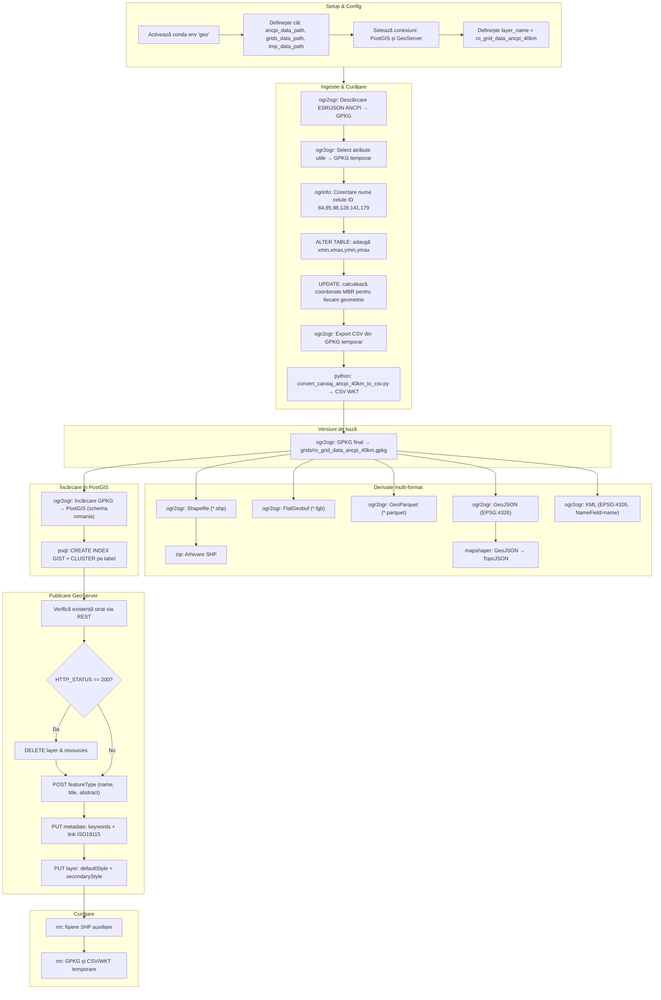

import useBaseUrl from '@docusaurus/useBaseUrl';
import React from 'react';

# Grid ANCPI 40km

## Cod set de date

**`ro_grid_data_ancpi_40km`**

<figure style={{ textAlign: "center" }}>
  
</figure>

## Abordare practică

Caroiajul geografic, format vectorial/poligon, 40 x 40 km, a fost descărcat folosind [API-ului Esri REST al ANCPI](https://geoportal.ancpi.ro/portal/apps/webappviewer/index.html?id=50289a41aafc4e01aefd131c2105e374) și procesat prin intermediul unui script Bash (mediu *nix). Pentru pașii de procesare, scriptul utilizează mai multe biblioteci open source și utilitare de sistem: [GDAL](https://gdal.org), [mapshaper](https://mapshaper.org/), [curl](https://curl.se/), zip. Scriptul rezultat este prezentat în secțiunea [Script ETL](#script-etl) și accesibil pentru descărcare pe pagina [GitHub](https://github.com/geospatialorg/ingestie-date/blob/main/publish_update_ro_grid_data_ancpi_40km.sh) a geo-spatial.org.

## Prelucrarea datelor

### Eliminarea câmpurilor cu informație nerelevantă

O serie din câmpuri au fost considerate neimportante pentru utilizatorul obișnuit: `Class1`, `Shape_STAr`, `Shape_STLe`, `Class2`, `Class3`, `Class4`, `Shape_ST_1`, `Shape_ST_2`, `Shape_Length`, `Shape_Area`, `Link`, `FrameTarget`. Aceste câmpuri au rolul lor pentru scopul inițial al ANCPI (distribuirea datelor MNAT) dar, pentru alte utilizări, nu prezintă importanță practică.

### Redenumirea câmpurilor existente

O serie de câmpuri au fost redenumite pentru a asigura consistența cu alte seturi de date publicate pe geo-spatial.org

### Corectare atributelor pentru o serie de celule din grid

Câteva celule din setul original aveau indicativele concatenate cu șirul de caractere `_c` (84, 85, 98, 128, 141, 179). Au fost corectate (de exemplu, `F13_c` a fost transformat în `F13` și similar).

### Corectarea geometriei caroiajului

Corectarea geometriei caroiajului pentru a acoperi strict o suprafață de 40 x 40 km. Setul original avea o foarte foarte mică abatere (aprox. 0.1 mm), abatere care ar afecta însă o serie de fluxuri de procesare a datelor raster ce se doresc perfect aliniate.

<figure style={{ textAlign: "center" }}>
  
  <figcaption><em>Extinderea caroiajului original.</em></figcaption>
</figure>

Pentru aceasta s-a folosit un truc tehnic:

- În tabela de atribute, pentru fiecare celulă, au fost adăugate câmpuri cu extinderea geografică în format `Integer` (coordonatele pentru `xmin`, `xmax`, `ymin`, `ymax`). În felul acesta, s-a eliminat acel offset minor al ;
- Fișierul GPKG a fost convertit în format CSV. Apoi, cu ajutorul unui script Python, fișierul CSV a fost convertit în format WKT folosind coordonatele calculate anterior. Astfel, s-a obținut o geometrie perfect aliniată cu dimensiunea de 40 x 40 km a caroiajului geografic.

### Conversia în formate de fișier populare

Datele finale au fost convertite în formatele de fișier utilizate de geo-spatial.org pentru distribuirea de date vectoriale: `GeoPackage`, `Shapefile`, `Geoparquet`, `FlatGeobuf`, `GeoJSON`, `TopoJSON`, `KML`. Detalii despre motivația alegerii acestor formate și beneficiile fiecăruia sunt prezentate în ghidul cu privire la date. De asemenea, pentru nevoi interne, datele au fost încărcate în baza de date PostgreSQL/PostGIS.

### Publicare datelor

Datele au fost documentate în [Catalogul geo-spatial.org](https://services.geo-spatial.org/geonetwork/srv/eng/catalog.search#/metadata/337d3cb7-45d1-4d60-91b5-76e566d389df) și puse la dispoziție pentru download/access prin protocolul HTTP și prin intermediul serviciilor standardizate OGC. Pentru mai multe detalii accesați [Catalogul](https://services.geo-spatial.org/geonetwork/srv/eng/catalog.search#/metadata/337d3cb7-45d1-4d60-91b5-76e566d389df) și/sau secțiunea <a href={useBaseUrl('descarcare/date/grids')}>Descărcare</a>. Definițiile folosite pentru simbolizarea WMS a datelor au fost documentate în secțiunea [Simbolizare SLD](#simbolizare-sld).

## Diagrama fluxului de lucru



<iframe
  src="https://geo-spatial.org/jsoncrack/editor/?json=https://geo-spatial.org/descrieri-etl-json/grids/etl_ro_grid_data_ancpi_40km.json"
  width="100%"
  height="600"
  style={{ border: '1px solid #ccc', borderRadius: '8px' }}
  loading="lazy"
/>

<a
  href="https://geo-spatial.org/jsoncrack/editor/?json=https://geo-spatial.org/descrieri-etl-json/grids/etl_ro_grid_data_ancpi_40km.json"
  target="_blank"
  rel="noopener noreferrer"
>
  Deschide diagrama într-o pagină separată <i className="fa fa-external-link-alt" style={{ marginLeft: '0.3rem' }}></i>
</a>

## Script ETL

```bash title="publish_update_ro_grid_data_ancpi_40km.sh"
#!/usr/bin/zsh

##############################################################################################################
#🛠 Publicare/actualizare Grid ANCPI 40km
##############################################################################################################

#🎛 configurații

#🕹 activare mediu Anaconda cu bibliotecile necesare pentru procesare
source /home/ubuntu/anaconda3/etc/profile.d/conda.sh
conda activate geo

#🚏 definire căi date
ancpi_data_path="/storage/volumes/geoserver-1-storage/brute/institutii_romania/ancpi/caroiaje"
grids_data_path="/storage/volumes/geoserver-1-storage/grids/data"
tmp_data_path="/storage/volumes/geoserver-1-storage/tmp"

#⚙️ PostGIS
pg_host="localhost"
pg_port=5432
pg_user="user"
pg_db="geospatial"
pg_pass="pass"
pg_schema="romania"

#⚙️ GeoServer
gs_url="http://localhost:8080/geoserver"
gs_user="user"
gs_pass="pass"
gs_workspace="grids"
gs_store="grids"
gs_layer_title="Caroiaje - Grid ANCPI 40km"
gs_layer_abstract="Set de date care conține caroiajul de 40 x 40 km, în proiecție Stereo70, creat de Agenția Națională de Cadastru și Publicitate Imobiliară pentru distribuirea Modelului Numeric Altimetric de Teren. Caroiajul este utilizat de geo-spatial.org pentru prelucrarea și distribuirea mai multor seturi de date."
gs_layer_keywords=("România" "caroiaj" "vector" "40x40km")
gs_layer_metadata_link="https://services.geo-spatial.org/geonetwork/srv/eng/catalog.search#/metadata/337d3cb7-45d1-4d60-91b5-76e566d389df"
gs_layer_style="grids:ro_grid_data_ancpi_40km_labels"
gs_layer_secondary_style="grids:ro_grid_data_ancpi_40km"

#⚙️ Date
layer_name="ro_grid_data_ancpi_40km"

echo "
🛠 Grid ANCPI 40km
 "

echo "💾 Descărcarea datelor de pe portalul ANCPI"

#💾 Descărcarea datelor de pe portalul ANCPI
ogr2ogr -f GPKG ${ancpi_data_path}/caroiaj_ancpi_40km.gpkg -nln caroiaj_ancpi_40km -nlt MULTIPOLYGON --config OGR_ORGANIZE_POLYGONS SKIP --config CPL_CURL_MAX_RETRY 5 --config CPL_CURL_RETRY_DELAY 2 --config CPL_CURL_HTTPS_VERSION TLSv1_2 -skipfailures  "ESRIJSON:https://geoportal.ancpi.ro/hosted_services/rest/services/Descarcare/MNT_tiles/MapServer/0/query?where=1%3D1&outFields=*&returnGeometry=true&f=json"

#💾 Eliminare câmpuri neutilizate
ogr2ogr -of GPKG -lco FID=id -nln caroiaj_ancpi_40km -dialect sqlite -sql "SELECT geom AS geometry, OBJECTID as id, Name as name, L as row, C as col FROM caroiaj_ancpi_40km" ${tmp_data_path}/caroiaj_ancpi_40km.gpkg ${ancpi_data_path}/caroiaj_ancpi_40km.gpkg

#💾 Corectare atribute pentru celulele 84, 85, 98, 128, 141, 179 (de exemplu, "F13_c" a fost transformat în "F13" și similar)
ogrinfo ${tmp_data_path}/caroiaj_ancpi_40km.gpkg -dialect SQLite -sql "UPDATE caroiaj_ancpi_40km SET name = 'F13' WHERE ID = 84"
ogrinfo ${tmp_data_path}/caroiaj_ancpi_40km.gpkg -dialect SQLite -sql "UPDATE caroiaj_ancpi_40km SET name = 'F14' WHERE ID = 85"
ogrinfo ${tmp_data_path}/caroiaj_ancpi_40km.gpkg -dialect SQLite -sql "UPDATE caroiaj_ancpi_40km SET name = 'G08' WHERE ID = 98"
ogrinfo ${tmp_data_path}/caroiaj_ancpi_40km.gpkg -dialect SQLite -sql "UPDATE caroiaj_ancpi_40km SET name = 'I15' WHERE ID = 128"
ogrinfo ${tmp_data_path}/caroiaj_ancpi_40km.gpkg -dialect SQLite -sql "UPDATE caroiaj_ancpi_40km SET name = 'J15' WHERE ID = 141"
ogrinfo ${tmp_data_path}/caroiaj_ancpi_40km.gpkg -dialect SQLite -sql "UPDATE caroiaj_ancpi_40km SET name = 'G13' WHERE ID = 179"

#💾 Calcularea coordonatelor xmin, xmax, ymin, ymax pentru fiecare celulă din caroiaj
ogrinfo ${tmp_data_path}/caroiaj_ancpi_40km.gpkg -sql "ALTER TABLE caroiaj_ancpi_40km ADD COLUMN xmin INTEGER"
ogrinfo ${tmp_data_path}/caroiaj_ancpi_40km.gpkg -sql "ALTER TABLE caroiaj_ancpi_40km ADD COLUMN xmax INTEGER"
ogrinfo ${tmp_data_path}/caroiaj_ancpi_40km.gpkg -sql "ALTER TABLE caroiaj_ancpi_40km ADD COLUMN ymin INTEGER"
ogrinfo ${tmp_data_path}/caroiaj_ancpi_40km.gpkg -sql "ALTER TABLE caroiaj_ancpi_40km ADD COLUMN ymax INTEGER"

ogrinfo ${tmp_data_path}/caroiaj_ancpi_40km.gpkg -dialect SQLite -sql "UPDATE caroiaj_ancpi_40km SET xmin = MbrMinX(geometry), xmax = MbrMaxX(geometry), ymin = MbrMinY(geometry), ymax = MbrMaxY(geometry)"

#💾 Conversie în format CSV
ogr2ogr -of CSV -dialect sqlite -sql "SELECT id, * FROM caroiaj_ancpi_40km" ${tmp_data_path}/caroiaj_ancpi_40km.csv ${tmp_data_path}/caroiaj_ancpi_40km.gpkg

#💾 Conversie CSV în format WKT
python convert_caroiaj_ancpi_40km_to_csv.py

#💾 creare versiune GeoPackage
echo "💾 creare versiune GeoPackage"
if [ -f ${grids_data_path}/${layer_name}.gpkg ]; then
    rm ${grids_data_path}/${layer_name}.gpkg
fi
ogr2ogr -of GPKG -lco FID=id -nln ${layer_name} -dialect sqlite -sql "SELECT geometry, id, name, row, col FROM caroiaj_ancpi_40km" ${grids_data_path}/${layer_name}.gpkg ${tmp_data_path}/caroiaj_ancpi_40km.gpkg

#💾 creare fișiere Esri Shapefile
echo "💾 creare fișiere Esri Shapefile"
if [ -f ${grids_data_path}/${layer_name}.zip ]; then
    rm ${grids_data_path}/${layer_name}.zip
fi
ogr2ogr -lco ENCODING=UTF-8 -nln ${layer_name} -dialect sqlite -sql "SELECT a.id AS id, * FROM ${layer_name} AS a" ${grids_data_path}/${layer_name}.shp ${grids_data_path}/${layer_name}.gpkg

#📦 arhivare fișiere shp
echo "📦 arhivare fișiere shp"
zip -j ${grids_data_path}/${layer_name}.zip ${grids_data_path}/${layer_name}.dbf ${grids_data_path}/${layer_name}.shp ${grids_data_path}/${layer_name}.prj ${grids_data_path}/${layer_name}.shx ${grids_data_path}/${layer_name}.cpg

#💾 creare versiune FlatGeobuf
echo "💾 creare versiune FlatGeobuf"
if [ -f ${grids_data_path}/${layer_name}.fgb ]; then
    rm ${grids_data_path}/${layer_name}.fgb
fi
ogr2ogr -of FlatGeobuf -nlt MULTIPOLYGON -nln ${layer_name} -dialect sqlite -sql "SELECT a.id AS id, * FROM ${layer_name} AS a" ${grids_data_path}/${layer_name}.fgb ${grids_data_path}/${layer_name}.gpkg

#💾 creare versiune GeoParquet
echo "💾 creare versiune GeoParquet"
if [ -f ${grids_data_path}/${layer_name}.parquet ]; then
    rm ${grids_data_path}/${layer_name}.parquet
fi
ogr2ogr -of Parquet -nlt MULTIPOLYGON -nln ${layer_name} -dialect sqlite -sql "SELECT a.id AS id, * FROM ${layer_name} AS a" ${grids_data_path}/${layer_name}.parquet ${grids_data_path}/${layer_name}.gpkg

#💾 creare versiune GeoJSON
echo "💾 creare versiune GeoJSON"
if [ -f ${grids_data_path}/${layer_name}.geojson ]; then
    rm ${grids_data_path}/${layer_name}.geojson
fi
ogr2ogr -of GeoJSON -t_srs EPSG:4326 -nln ${layer_name} -dialect sqlite -sql "SELECT a.id AS id, * FROM ${layer_name} AS a" ${grids_data_path}/${layer_name}.geojson ${grids_data_path}/${layer_name}.gpkg

#💾 creare versiune KML
echo "💾 creare versiune KML"
if [ -f ${grids_data_path}/${layer_name}.kml ]; then
    rm ${grids_data_path}/${layer_name}.kml
fi
ogr2ogr -of KML -t_srs EPSG:4326 -dsco NameField=name ${grids_data_path}/${layer_name}.kml ${grids_data_path}/${layer_name}.gpkg

#💾 creare versiune TopoJSON
echo "💾 creare versiune TopoJSON"
if [ -f ${grids_data_path}/${layer_name}.topojson ]; then
    rm ${grids_data_path}/${layer_name}.topojson
fi
mapshaper -i ${grids_data_path}/${layer_name}.geojson -o format=topojson ${grids_data_path}/${layer_name}.topojson

#💾 actualizarea setului de date în baza de date PostGIS
echo "💾 actualizarea setului de date în baza de date PostGIS"
ogr2ogr -of PostgreSQL PG:"host=${pg_host} port=${pg_port} user=${pg_user} dbname=${pg_db} password=${pg_pass}" -lco schema=${pg_schema} -lco GEOMETRY_NAME=geom -lco overwrite=yes ${grids_data_path}/${layer_name}.gpkg ${layer_name} -skipfailures -overwrite

#🖇 indexare date PostGIS
psql -h ${pg_host} -p ${pg_port} -U ${pg_user} -d ${pg_db} -c "
CREATE INDEX ${layer_name}_geom_idx ON romania.${layer_name} USING GIST (geom);
CLUSTER romania.${layer_name} USING ${layer_name}_geom_idx;"

#💾 publicarea/actualizarea serviciilor de date
echo "💾 publicarea/actualizarea serviciilor de date"

#❌ ștergere strat existent (dacă există)
echo "🔍 Verificare dacă există stratul."
HTTP_STATUS=$(curl -s -o /dev/null -w "%{http_code}" -u $gs_user:$gs_pass \
  "${gs_url}/rest/layers/${gs_workspace}:${layer_name}.xml")

if [ "$HTTP_STATUS" == "200" ]; then
    echo "⚠️  Stratul există. Se șterge."
    curl -s -u $gs_user:$gs_pass -XDELETE \
      "${gs_url}/rest/layers/${gs_workspace}:${layer_name}?recurse=true"
    echo "🗑️  Stratul a fost șters."
else
    echo "✅ Nu există strat cu acest nume."
fi

#💾 creare strat
echo "➕ Creare strat ${layer_name}"
curl -s -u $gs_user:$gs_pass -XPOST -H "Content-type: text/xml" \
  -d "<featureType>
         <name>${layer_name}</name>
         <nativeName>${layer_name}</nativeName>
         <title>${gs_layer_title}</title>
         <abstract>${gs_layer_abstract}</abstract>
     </featureType>" \
  "${gs_url}/rest/workspaces/${gs_workspace}/datastores/${gs_store}/featuretypes"

#💾 adăugare detalii suplimentare (keywords și metadata link)
echo "📝 Actualizare metadate"
keywords_xml=""
for keyword in "${gs_layer_keywords[@]}"; do
    keywords_xml+="<string>${keyword}</string>"
done

curl -s -u $gs_user:$gs_pass -XPUT -H "Content-type: text/xml" \
-d "<featureType>
        <keywords>
            ${keywords_xml}
        </keywords>
        <metadataLinks>
            <metadataLink>
                <type>text/xml</type>
                <metadataType>ISO19115:2003</metadataType>
                <content>${gs_layer_metadata_link}</content>
            </metadataLink>
        </metadataLinks>
    </featureType>" \
"${gs_url}/rest/workspaces/${gs_workspace}/datastores/${gs_store}/featuretypes/${layer_name}"

#💾 Setare stil implicit + atașare stil suplimentar
echo "🎨 Setare stil implicit + atașare stil suplimentar..."
curl -s -u $gs_user:$gs_pass -XPUT -H "Content-type: text/xml" \
  -d "<layer>
         <defaultStyle>
             <name>${gs_layer_style##*:}</name>
         </defaultStyle>
         <styles>
             <style>
                 <name>${gs_layer_secondary_style##*:}</name>
             </style>
         </styles>
     </layer>" \
  "${gs_url}/rest/layers/${gs_workspace}:${layer_name}"

echo "✅ Stratul ${layer_name} a fost adăugat și configurat cu succes în GeoServer."

#🗑️ Ștergere fișiere intermediare
echo "🗑️ Ștergere fișiere intermediare"
rm ${grids_data_path}/${layer_name}.dbf ${grids_data_path}/${layer_name}.shp ${grids_data_path}/${layer_name}.prj ${grids_data_path}/${layer_name}.shx ${grids_data_path}/${layer_name}.cpg ${tmp_data_path}/caroiaj_ancpi_40km.gpkg ${tmp_data_path}/caroiaj_ancpi_40km.csv ${tmp_data_path}/caroiaj_ancpi_40km.wkt
```
Script accesibil și pe [GitHub](https://github.com/geospatialorg/ingestie-date/blob/main/publish_update_ro_admin_lau_polygon.sh).

## Simbolizare SLD

### Simbolizare SLD implicită

```xml title="ro_grid_data_ancpi_40km_labels.sld"
<?xml version="1.0" encoding="UTF-8"?>
<StyledLayerDescriptor xmlns="http://www.opengis.net/sld" xmlns:ogc="http://www.opengis.net/ogc" xmlns:xlink="http://www.w3.org/1999/xlink" xmlns:xsi="http://www.w3.org/2001/XMLSchema-instance" version="1.1.0" xmlns:se="http://www.opengis.net/se" xsi:schemaLocation="http://www.opengis.net/sld http://schemas.opengis.net/sld/1.1.0/StyledLayerDescriptor.xsd">
  <NamedLayer>
    <se:Name>ro_grid_data_ancpi_40km</se:Name>
    <UserStyle>
      <se:Name>ro_grid_data_ancpi_40km</se:Name>
      <se:FeatureTypeStyle>
        <se:Rule>
          <se:Name>Grid ANCPI 40km</se:Name>
          <se:Description>
            <se:Title>Grid ANCPI 40km</se:Title>
          </se:Description>
          <se:MinScaleDenominator>5000000</se:MinScaleDenominator>
          <se:LineSymbolizer>
            <se:Stroke>
              <se:SvgParameter name="stroke">#000000</se:SvgParameter>
              <se:SvgParameter name="stroke-width">2</se:SvgParameter>
              <se:SvgParameter name="stroke-linejoin">bevel</se:SvgParameter>
              <se:SvgParameter name="stroke-linecap">square</se:SvgParameter>
            </se:Stroke>
          </se:LineSymbolizer>
        </se:Rule>
        <se:Rule>
          <se:Name>Grid ANCPI 40km</se:Name>
          <se:Description>
            <se:Title>Grid ANCPI 40km</se:Title>
          </se:Description>
          <se:MaxScaleDenominator>5000000</se:MaxScaleDenominator>
          <se:LineSymbolizer>
            <se:Stroke>
              <se:SvgParameter name="stroke">#000000</se:SvgParameter>
              <se:SvgParameter name="stroke-width">2</se:SvgParameter>
              <se:SvgParameter name="stroke-linejoin">bevel</se:SvgParameter>
              <se:SvgParameter name="stroke-linecap">square</se:SvgParameter>
            </se:Stroke>
          </se:LineSymbolizer>
        </se:Rule>
        <se:Rule>
          <se:MaxScaleDenominator>5000000</se:MaxScaleDenominator>
          <se:TextSymbolizer>
            <se:Label>
              <ogc:PropertyName>name</ogc:PropertyName>
            </se:Label>
            <se:Font>
              <se:SvgParameter name="font-family">Helvetica</se:SvgParameter>
              <se:SvgParameter name="font-size">14</se:SvgParameter>
            </se:Font>
            <se:LabelPlacement>
              <se:PointPlacement>
                <se:AnchorPoint>
                  <se:AnchorPointX>0</se:AnchorPointX>
                  <se:AnchorPointY>0.5</se:AnchorPointY>
                </se:AnchorPoint>
              </se:PointPlacement>
            </se:LabelPlacement>
            <se:Halo>
              <se:Radius>1</se:Radius>
              <se:Fill>
                <se:SvgParameter name="fill">#ffffff</se:SvgParameter>
              </se:Fill>
            </se:Halo>
            <se:Fill>
              <se:SvgParameter name="fill">#000000</se:SvgParameter>
            </se:Fill>
            <se:VendorOption name="maxDisplacement">1</se:VendorOption>
          </se:TextSymbolizer>
        </se:Rule>
      </se:FeatureTypeStyle>
    </UserStyle>
  </NamedLayer>
</StyledLayerDescriptor>
```
Fișier accesibil și pe [GitHub](https://github.com/geospatialorg/simbolizare/blob/main/sld/grids/ro_grid_data_ancpi_40km_labels.sld).

### Simbolizare SLD alternativă

```xml title="ro_grid_data_ancpi_40km.sld"
<?xml version="1.0" encoding="UTF-8"?>
<StyledLayerDescriptor xmlns="http://www.opengis.net/sld" xmlns:ogc="http://www.opengis.net/ogc" xmlns:xlink="http://www.w3.org/1999/xlink" xmlns:xsi="http://www.w3.org/2001/XMLSchema-instance" version="1.1.0" xmlns:se="http://www.opengis.net/se" xsi:schemaLocation="http://www.opengis.net/sld http://schemas.opengis.net/sld/1.1.0/StyledLayerDescriptor.xsd">
  <NamedLayer>
    <se:Name>ro_grid_data_ancpi_40km</se:Name>
    <UserStyle>
      <se:Name>ro_grid_data_ancpi_40km</se:Name>
      <se:FeatureTypeStyle>
        <se:Rule>
          <se:Name>Single symbol</se:Name>
          <se:LineSymbolizer>
            <se:Stroke>
              <se:SvgParameter name="stroke">#000000</se:SvgParameter>
              <se:SvgParameter name="stroke-width">2</se:SvgParameter>
              <se:SvgParameter name="stroke-linejoin">bevel</se:SvgParameter>
              <se:SvgParameter name="stroke-linecap">square</se:SvgParameter>
            </se:Stroke>
          </se:LineSymbolizer>
        </se:Rule>
      </se:FeatureTypeStyle>
    </UserStyle>
  </NamedLayer>
</StyledLayerDescriptor>
```
Fișier accesibil și pe [GitHub](https://github.com/geospatialorg/simbolizare/blob/main/sld/grids/ro_grid_data_ancpi_40km.sld).
